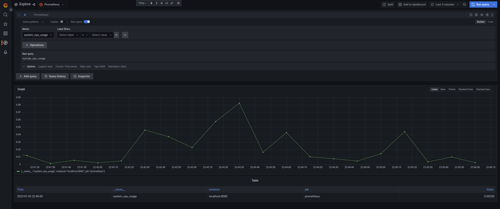
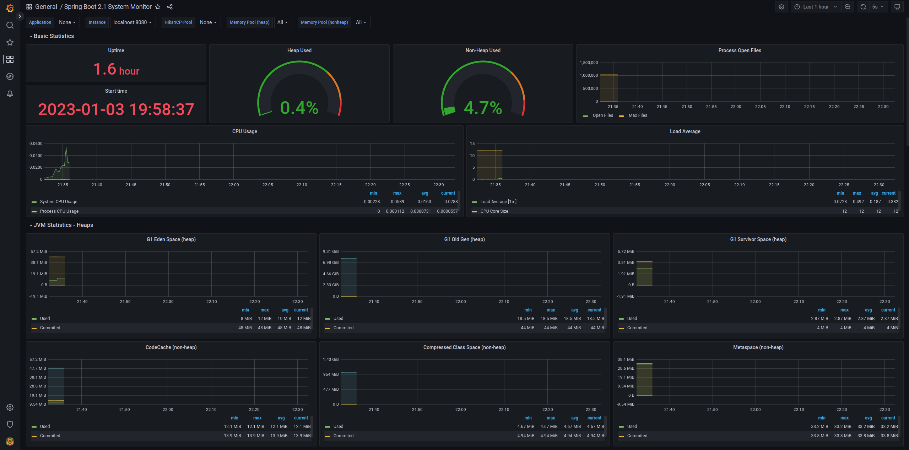

# A Spring Boot demo for Prometheus metrics over Grafana

Project contains a simple Spring Boot demo for showing Prometheus metrics over Grafana. Installation instructions are for Linux only.

**This project is only for demo purposes!**

* After downloading project, import project with your preferred IDE and from pom and do mvn clean - install
* Install and run Prometheus : 
    * Head over to this site and download-install Prometheus https://prometheus.io/download/
    * For linux go to downloaded tar.gz and extract it. 
    * There is a **prometheus.yml** file in this extracted folder, you should add **metrics_path: "/actuator/prometheus"** under **job_name: "prometheus"** (see **sample-prometheus.yml**)
    * The above step is needed for binding Spring Actuator Metrics to Prometheus
    * Then run **prometheus** executable in the same folder.
    * If everything is successful then you should see Prometheus panel over http://localhost:9090/ in browser.
* Install and run Grafana
    * Head over to this site and download-install Grafana https://grafana.com/grafana/download
    * After installation run Grafana (For linux you can run this command in terminal **sudo /bin/systemctl start grafana-server**)
    * If everything is successful then you should see Grafana panel over http://localhost:3000/ in browser.
* Run spring boot application and get metrics from Grafana
  * Run demo spring boot application, it will expose health,info and Prometheus metrics (see **application.properties**)
  * Go to http://localhost:3000/datasources/new and select **Prometheus**
  * By doing below steps we will be adding a Prometheus datasource to Grafana
  * You can give a name to your datasource
  * At **HTTP** section give this url to expose Prometheus to Grafana: http://localhost:9090/
  * Check if this is working by clicking **Save and Test** button at the end of the page
  * If everything is successful you should see **Data source is working** above the aforementioned button
  * Head over to **Explore** at the left panel of Grafana
  * At the top of the page select your Prometheus datasource (if there is only one datasource then yours will be there by default)
  * Select a metric in **Metric** dropdown panel
  * After selecting a metric click the **Run query** button at the top right of the page
  * Now you should see a graph below the page
  * 
* You can also add predefined dashboards to Grafana
  * Go to https://grafana.com/grafana/dashboards/
  * Download whichever dashboard suits your need
  * For this project a dashboard named Spring Boot 2.1 System Monitor is downloaded (see **justai-system-monitor_rev2.json**)
  * Head over to http://localhost:3000/dashboards
  * On this page click **New** button at the middle right side of the page then select **Import**
  * On the newly opened page select **Upload JSON file** then upload downloaded json dashboard file
  * Again head over to http://localhost:3000/dashboards and select your newly added dashboard (in our case **Spring Boot 2.1 System Monitor**)
  * On this page you can see metrics about this Spring application.
  * For more info and tutorials you can visit https://grafana.com/tutorials/ and https://prometheus.io/docs/introduction/overview/
  * 
* Tested with below specs : 
  * Spring boot 3.0.1
  * Prometheus 2.41.0 Linux Amd64
  * Grafana Enterprise 9.3.2 Amd64
  * JDK 17